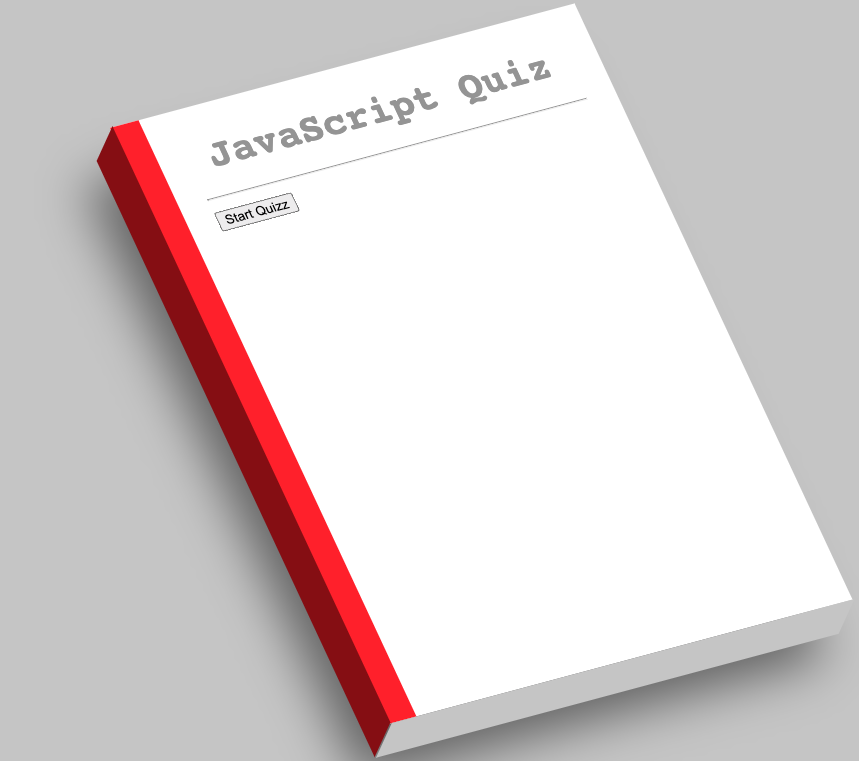
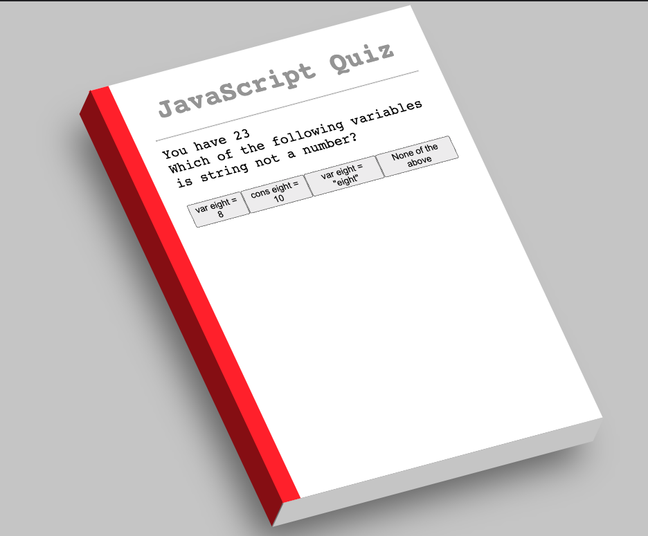
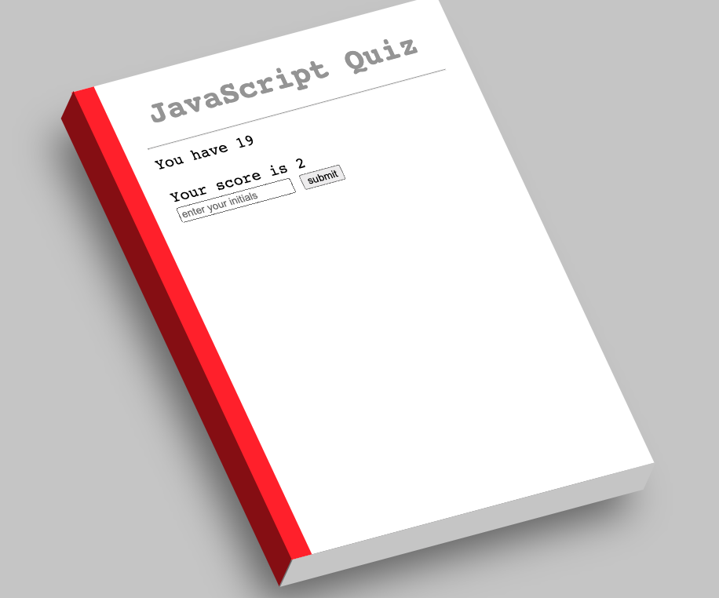

# JavaScript Mini Quiz - Challenge 04

This challenge involves creating almost everything from the JS, using different learned methods to create HTML elements, acesss the local storage, creatng objects, among many others. The end goal is to have a dynamic quiz, which decreases time if the user answers wrong, and has an overall timer to take the quiz.

## User Story -->
_US:_
AS A coding boot camp student
I WANT to take a timed quiz on JavaScript fundamentals that stores high scores
SO THAT I can gauge my progress compared to my peers
## Acceptance Criteria -->
_AC:_

GIVEN I am taking a code quiz
WHEN I click the start button
THEN a timer starts
and I am presented with a question
WHEN I answer a question
THEN I am presented with another question
WHEN I answer a question incorrectly
THEN time is subtracted from the clock
WHEN all questions are answered or the timer reaches 0
THEN the game is over
WHEN the game is over
THEN I can save my initials and score
## Screenshots of the Webpage:
### Start of the game -->

### Playing the game -->

### Game Over -->

## Important Notes:
CSS Design is not of mine entirely, it is referenced from https://codepen.io/mina-mounir/pen/gOPppdv 
and was modified to this use case and user story needs by me.

## Here's the link to the deployed Webpage:
